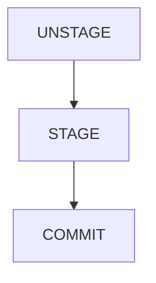

# Getting help

```shell
git help <verb>
git <verb> --help
```

# Getting a git repository 

1. You can turn any of your local directory into git repository by running `git init` command under it.
2. OR you can "clone" any repository available on code repository servers using `git clone` command.

# Initializing a Repository in an Existing Directory

```shell
cd </path-to-directory/>
git init
```
- This step will create a directory called `.git`. The directory is starting with DOT. which means, it's hidden 
  directory. You can run `ls -la` to see hidden directories in `git bash` tool.
- `.git` directory contains all the information that is necessary for your project in version control and all the
  information about commits, remote repository address, etc. All of them are present in this folder. It also contains a
  log that stores your commit history so that you can roll back to history.

# Cloning an Existing Repository

- If you want to get a copy of an existing Git repository - For example a project from `github.com` -
  the command you need is `git clone`.

```shell
git clone <https-url-to-code-repo>
```

# Ignoring Files

- Sometimes we have files under `project root` directory that are not code 
  (or files should not be part of code repository)
- For example - log files, temporary files generated by editor, .pyc files, virtual environment related directory etc.

- We do NOT want `git` to track these files. 
- So we create a file called `.gitignore` and mention pattern of files that `git` should ignore.
- Here are examples of `.gitignore` file content (**NOTE** - # `HASH` character is used for comment.)

```shell
# To ignore all files with `.pyc` extension
*.pyc

# To ignore all files with `.xml` extension
*.xml

# To ignore all files with `.json` extension
*.json

# To ignore all files related to virtual environment
venv

# To ignore all files with `.log` extension
*.log
```

# Viewing Your Staged and Un-staged Changes



```shell
$ git status
```
```
On branch master                                                                       # tells which `branch` you're on
Your branch is up-to-date with 'origin/master'.                                        # tells remote branch name
Changes to be committed:                                                               # tells staged files
  (use "git reset HEAD <file>..." to unstage)

    modified:   README

Changes not staged for commit:                                                         # tells un-staged files
  (use "git add <file>..." to update what will be committed)
  (use "git checkout -- <file>..." to discard changes in working directory)

    modified:   CONTRIBUTING.md
```

# Committing Your Changes

- Once your staging area is set up the way you want it, you can commit your changes.

- Remember that anything that is still un-staged — any files you have created or modified that you haven’t run git add
  on since you edited them — won’t go into this commit.
- They will stay as modified files on your disk. In this case, let’s say that the last time you ran git status, you saw
  that everything was staged, so you’re ready to commit your changes.
- The simplest way to commit is to type git commit:
```shell
git commit

# If you want to pass your own commit message along, use following syntax -
git commit -m "<your-custom-commit-message>"
```

# Viewing the Commit History

After you have created several commits, or if you have cloned a repository with an existing commit history, 
you’ll probably want to look back to see what has happened. The most basic and powerful tool to do this is the
`git log` command.
```shell
git log
```

# Un-staging a Staged File

```shell
git reset HEAD <file-path>
```

# How to discard changes in modified file?
```shell
git checkout <file-path>

# alternatively, you can also use following command
git restore <file-path>
```

# Working with remotes

